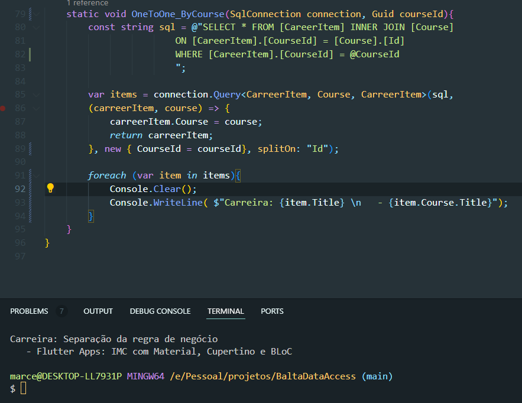

Essa é uma consulta One to One, que busca Item de uma carreira e seu curso relacionado, e filtra a busca pelo id do curso.

Tenho uma estrutura onde tenho **ITEM DE CARREIRA** e essa classe possui algumas propriedades, descrição, título, e curso.
Oque mais interessa é **CURSO** pois é um outro objeto que está relacionado. E um **ITEM DE CARREIRA** só pode possuir um único **CURSO**.

Para encontrar um **CURSO** específico e seu **ITEM DE CARREIRA** relacionado fiz uma consulta na tabela CarreerItem buscando onde a chave estrangeira de curso era igual ao que eu buscava, pois não quero todos os items de carreira, quero de um curso específico.
Fiz um join, para que todos os dados do curso fossem trazidos junto.
E por fim fiz o mapeamento, colocando Curso, dentro de CarreerItem.
